# Orchestrator Subsystem

**Namespace:** `Orchestrator`  
**Status:** Active / Modularized (Session 5)  
**Last Updated:** Jan 2026

## Overview

The Orchestrator is the central nervous system of the Quannex demo experience. It manages the user journey through the 5-step wizard, handles state synchronization across multiple windows, and coordinates the visualization updates.

## Module Architecture

The system is split into specialized modules for maintainability:

| Module | Purpose | Dependencies |
|--------|---------|--------------|
| `orchestrator-state.js` | Central state management (`demoState`) and PHI constants. | None |
| `orchestrator-session.js` | Session persistence and expiry management. | None |
| `orchestrator-utils.js` | Utility functions for diagnostics, exports, and shared helpers. | `orchestrator-state.js` |
| `orchestrator-dashboard.js` | Coordinator for the Step 4 Dashboard (Octave/Breath/Foundation). | `orchestrator-state.js`, `dashboard/*` |
| `orchestrator-steps.js` | Core logic for the 5-step wizard (face config, KPI entry, calculation). | `orchestrator-state.js`, `orchestrator-utils.js` |
| `orchestrator-navigation.js` | Navigation logic, URL handling, and initialization. | `orchestrator-state.js`, `orchestrator-session.js` |
| `orchestrator-sync.js` | Cross-window synchronization via BroadcastChannel. | `orchestrator-state.js` |

## Dependency Graph

```mermaid
graph TD
    Utils[logger.js] --> State[orchestrator-state.js]
    State --> Session[orchestrator-session.js]
    State --> Logic[orchestrator-utils.js]
    State --> Dashboard[orchestrator-dashboard.js]
    State --> Steps[orchestrator-steps.js]
    State --> Nav[orchestrator-navigation.js]
    
    Session --> Nav
    Logic --> Steps
    Logic --> Nav
    Dashboard --> Steps
    Steps --> Nav
```

## Logging

All modules utilize the centralized `Logger` utility with specific namespaces:
- `OrchestratorState`
- `OrchestratorSession`
- `OrchestratorUtils`
- `OrchestratorDashboard`
- `OrchestratorSteps`
- `OrchestratorNav`
- `CrossWindowSync`

## Key Features

1.  **State Management**: `demoState` global object tracks progress, configuration, and results.
2.  **Session Persistence**: Data is saved to `sessionStorage` and restored on reload or navigation.
3.  **Cross-Window Sync**: Updates in the Main Orchestrator are broadcast to visualization windows (3D Dodecahedron, DNA, etc.) in real-time.
4.  **Modular Dashboard**: The Step 4 dashboard is composed of sub-modules (`dashboard/*.js`) coordinated by `orchestrator-dashboard.js`.

## Usage

The system is initialized by `orchestrator-navigation.js` on `DOMContentLoaded`.
Entry point: `initializeDemo()`
